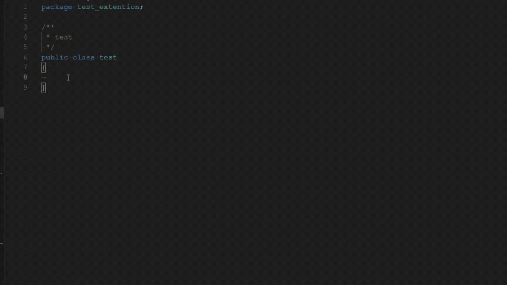

# Java Autocomplétions

## Description

L'extension "Java Autocomplétions" pour Visual Studio Code (VSCode) est un outil pratique pour les développeurs Java. Elle propose une collection de snippets personnalisés pour simplifier la rédaction de code Java, en suivant le style d'indentation Allman. Cette extension facilite la création de méthodes courantes et de modèles de code, améliorant ainsi votre productivité en développement Java.

## Fonctionnalités

- Snippets Java personnalisés pour les opérations courantes.
- Générez rapidement du code Java structuré.
- Optimisez votre flux de travail de développement Java.

## Installation

1. Ouvrez Visual Studio Code.
2. Allez dans l'onglet "Extensions" (ou utilisez le raccourci `Ctrl+Shift+X`).
3. Recherchez "Java Autocomplétions" et cliquez sur "Installer".
4. Redémarrez VSCode si nécessaire.

## Utilisation

L'extension "JAVA Autocomplétions" ajoute des snippets personnalisés pour Java et importe les classes nécessaires à l'utilisation de ceux-ci. Vous pouvez les utiliser en tapant les préfixes de snippet dans votre code Java, puis en appuyant sur la touche `Tab` pour compléter le code.

### Exemples de Snippets

- `lirefichier` : Génère une méthode pour lire un fichier et traiter les lignes.

## Contributions

Les contributions sont les bienvenues ! Si vous souhaitez contribuer à l'amélioration de cette extension, n'hésitez pas à créer une demande de pull sur GitHub.

## Licence

Ce projet est open source sous licence. Voir le fichier [LICENSE](LICENSE.md) pour plus de détails.

## Contact

Pour toute question ou commentaire concernant cette extension, veuillez contacter l'auteur, TomDunet, à l'adresse email suivante : **tomdunet.contact@gmail.com**

## Suggestions et Évaluation

Si vous avez des suggestions, veuillez ne pas donner une mauvaise évaluation à l'extension. Au lieu de cela, [ouvrez une demande](https://github.com/Oridoshi/java-autocompletions/issues) sur la page du projet Github, et j'essaierai de l'ajouter lorsque cela sera possible.

Si vous appréciez l'extension, veuillez lui attribuer une note de 5⭐. Et, si vous vous sentez particulièrement gentil aujourd'hui, laissez également un commentaire aimable : [Évaluez cette extension](https://marketplace.visualstudio.com/items?itemName=TomDunet.java-autocompletions&ssr=false#review-details).

---

Développé par [Dunet Tom](https://github.com/Oridoshi)